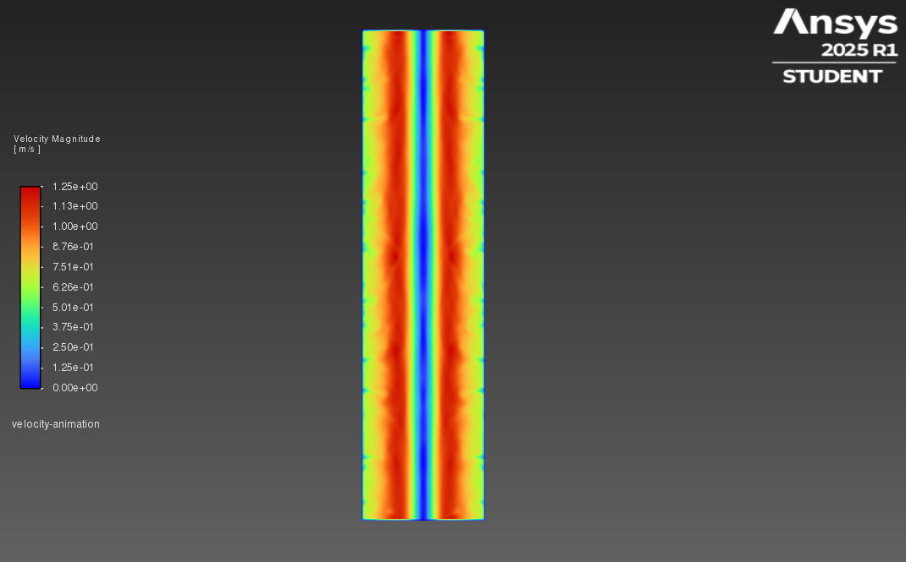
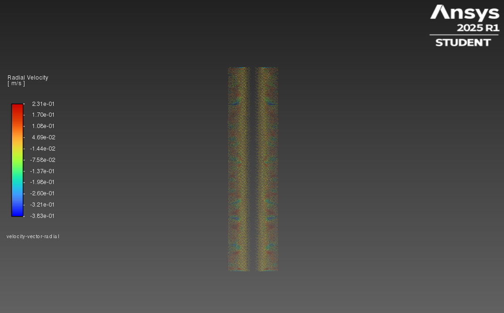
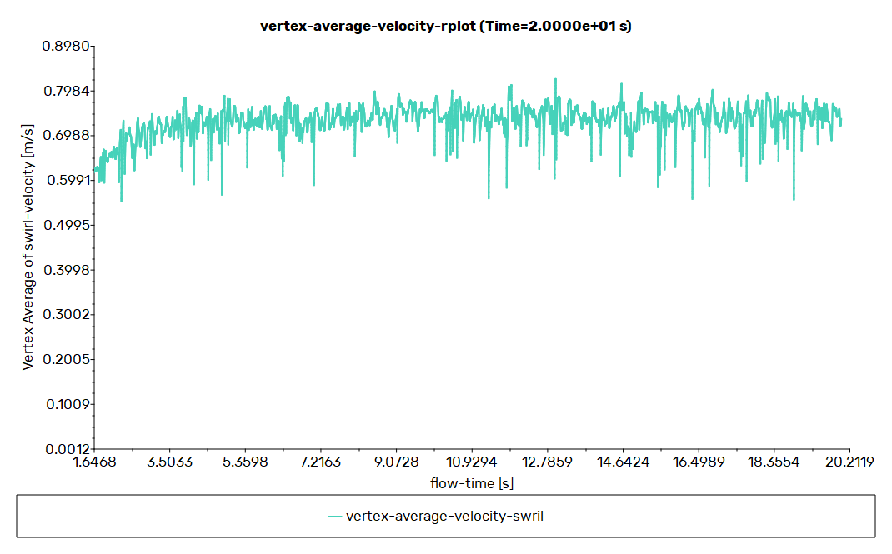
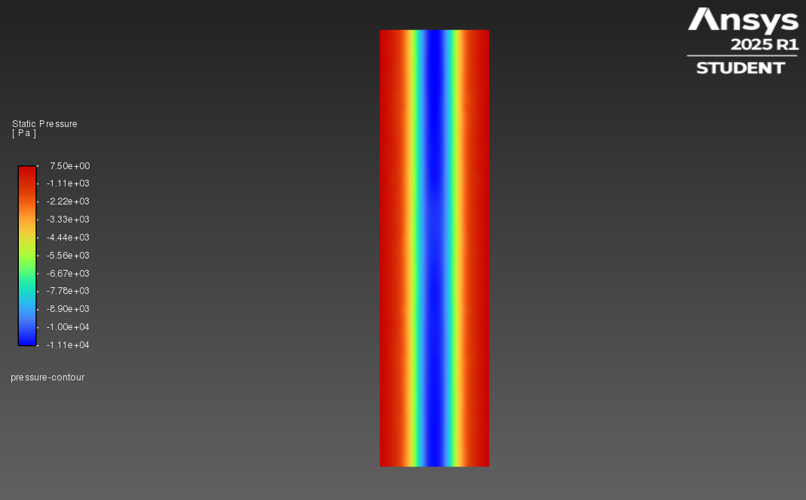
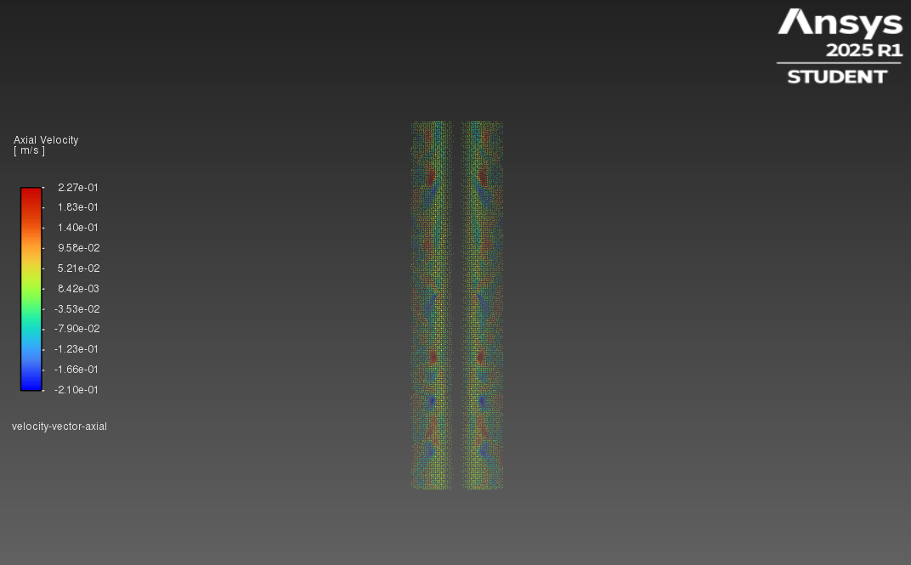

# MHD-Continuous-Casting-CFD-Validation
CFD reproduction of electromagnetic stirring (EMS) in continuous casting based on Zhang et al. (2022). Validated with &lt;4.2% error using Ansys Fluent &amp; Custom UDFs.

# CFD Validation: MHD-Driven Flow in Continuous Casting
### Replication of "Experimental Evaluation of MHD Modeling of EMS During Continuous Casting" (Zhang et al., 2022)

**Author:** Burak Yörükçü  
**Software:** Ansys Fluent 2025 R1  
**Status:** ✅ Validated (Error Margin < 4.2%)

---

## 📌 Executive Summary

This project reproduces the numerical simulation results of the Electromagnetic Stirring (EMS) experiment presented by *Zhang et al. (2022)*. The study focuses on the interaction between magnetic fields and fluid dynamics (MHD) in a closed cylindrical domain filled with liquid metal alloy (Ga75In25).

Using **Ansys Fluent** and a custom **User-Defined Function (UDF)** written in C, the "Calculation Method 3" (Coupled EM-CFD) was successfully implemented.

### 🏆 Key Achievements
* **Rapid Development:** Full simulation setup, debugging, and validation completed in **< 72 hours**.
* **High Accuracy:** Achieved a maximum swirl velocity of **1.25 m/s** (Benchmark: 1.20 m/s), resulting in a **4.16% deviation**, well within experimental uncertainty.
* **Advanced Physics:** Captured complex **Taylor-Görtler vortices** driven by centrifugal instability, confirming high-fidelity transient resolution.

---

## ⚙️ Methodology & Mesh Strategy

### Physics Setup
* **Domain:** 2D Axisymmetric Swirl ($R=12.5 mm$, $H=100 mm$).
* **Material:** Ga75In25 Alloy ($\rho=6517.5 kg/m^3$, $\sigma=3.6e6 S/m$).
* **Time Stepping:** Adaptive stepping (Initial: $10^{-5}s$, Final: $10^{-3}s$) to manage Courant number (CFL).

### Mesh Topology
To accurately resolve the steep velocity gradients near the walls (No-Slip condition) without using wall functions, a structured mesh with high-resolution inflation layers was generated.


*Figure: Structured mesh with inflation layers near the outer wall.*

### Custom UDF (`final_udf.c`)
A C-based User-Defined Function was developed to apply the Lorentz Force as a source term. Key features:
1.  **Frequency Correction:** Includes the angular frequency ($\omega_B$) term.
2.  **Slip Factor:** Implements $(1 - \omega_{liquid}/\omega_{field})$ correction.
3.  **Soft-Start:** A linear ramping function prevents numerical divergence at $t=0$.

---

## 📊 Validation Results

### 1. Velocity Distribution & Magnitude
Comparison of the simulated velocity field against the experimental benchmark. The model correctly predicts high-velocity regions near the walls and the zero-velocity zone at the axis.

| Velocity Contour (Vertical) | Radial Velocity Vectors |
|:---------------------------:|:-----------------------:|
|  |  |
| *Max Velocity: 1.25 m/s* | *Secondary flow patterns* |

### 2. Transient Flow Physics (Taylor-Görtler Vortices)
The monitor plot below tracks the swirl velocity at the reference point ($r=10mm, z=50mm$). The distinct high-frequency oscillations observed after $t=2.0s$ are **physical evidence** of Taylor-Görtler vortices generated by centrifugal instability, matching Fig. 6(a) of the reference paper.


*Figure: Time evolution of swirl velocity reaching quasi-steady state.*

### 3. Pressure Field
Static pressure distribution showing the radial gradient generated by centrifugal forces.

| Pressure Contour | Axial Velocity Vectors |
|:----------------:|:----------------------:|
|  |  |

---

## 🎬 Animations

<details>
  <summary><strong>Click to view Flow Animations (GIFs)</strong></summary>

### Swirl Velocity Evolution
Development of the rotating flow from rest to steady state. Note the "soft-start" ramp-up in the beginning.


### Static Pressure Build-up
Visualization of pressure gradient formation due to rotation.


</details>

---

## 📂 Repository Structure

* `final_udf.c` - The C source code for the Lorentz Force UDF.
* `mesh.png` - Visual of the computational grid.
* `velocity_cont.png` - Final velocity magnitude contour.
* `pressure_cont.png` - Final static pressure contour.
* `vertex_avg_vel.png` - Monitor plot of velocity over time.
* `scaled_residuals.png` - Convergence history.
* `swirl.gif` - Transient animation of swirl velocity.
* `pressure.gif` - Transient animation of static pressure.
* `radial_velocity_vectors.png` - Vector analysis of radial flow.
* `axial_velocity_vectors.png` - Vector analysis of axial flow.

---

## 📚 Reference
> Zhang, H., Wu, M., Zhang, Z., Ludwig, A., Kharicha, A., Rónaföldi, A., ... & Svéda, M. (2022). **Experimental Evaluation of MHD Modeling of EMS During Continuous Casting.** *Metallurgical and Materials Transactions B*, 53, 2166–2181. [DOI: 10.1007/s11663-022-02516-3](https://doi.org/10.1007/s11663-022-02516-3)

---

## 🧾 Lorentz Force UDF (`final_udf.c`)

```c
#include "udf.h"

/* * Lorentz Force UDF for 2D Axisymmetric Swirl MHD Simulation
 * Replication of Zhang et al. (2022), Calculation Method 3 (Sim C)
 */

DEFINE_SOURCE(lorentz_source_zhang_method, c, t, dS, eqn)
{
    /* --- Simulation Parameters (Case 3) --- */
    real B_max = 0.028;       // Magnetic Induction [Tesla] (28 mT)
    real sigma = 3.6e6;       // Electrical Conductivity [S/m]
    real f = 50.0;            // Frequency [Hz]
    
    /* Angular Frequency: 2 * pi * f = 314.16 rad/s */
    real omega_B = 2.0 * M_PI * f; 

    /* --- 1. Coordinates (For rotated mesh: x=axial, y=radial) --- */
    real xc[ND_ND];
    C_CENTROID(xc, c, t);
    
    /* In 2D Axisymmetric mode, y-coordinate corresponds to Radius */
    real r = xc[1]; 

    /* Swirl Velocity (Tangential Velocity) */
    real u_theta = C_W(c, t); 

    /* Division by zero protection at axis */
    if (r < 1.0e-5) r = 1.0e-5;

    /* --- 2. Slip Factor Correction --- */
    /* Corrects force based on relative motion between fluid and field */
    real slip_factor = 1.0 - (u_theta / (omega_B * r));

    /* --- 3. Soft-Start (Ramping) --- */
    /* Prevents numerical shock at t=0 by ramping force over 0.1s */
    real current_time = CURRENT_TIME;
    real ramp_time = 0.1; 
    real time_factor = 1.0;
    
    if (current_time < ramp_time)
        time_factor = current_time / ramp_time;

    /* --- 4. Lorentz Force Calculation --- */
    /* F = 0.5 * sigma * omega * B^2 * r * slip_factor */
    real F_theta = 0.5 * sigma * omega_B * B_max * B_max * r * slip_factor * time_factor;

    /* --- 5. Linearization (Derivative) --- */
    /* dF/du = -0.5 * sigma * B^2 (stabilizes the solver) */
    dS[eqn] = -0.5 * sigma * B_max * B_max * time_factor;

    return F_theta;
}
